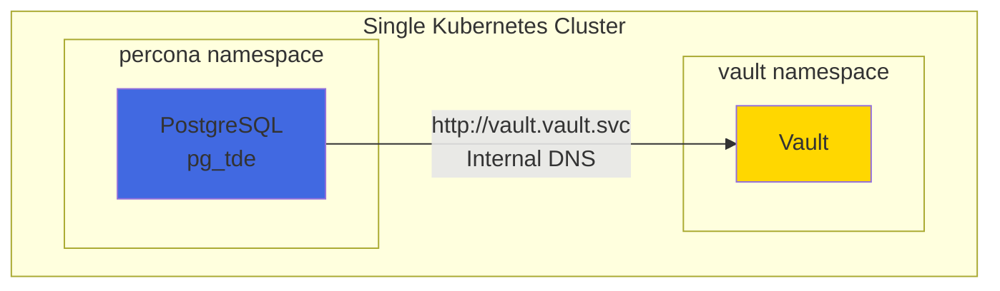
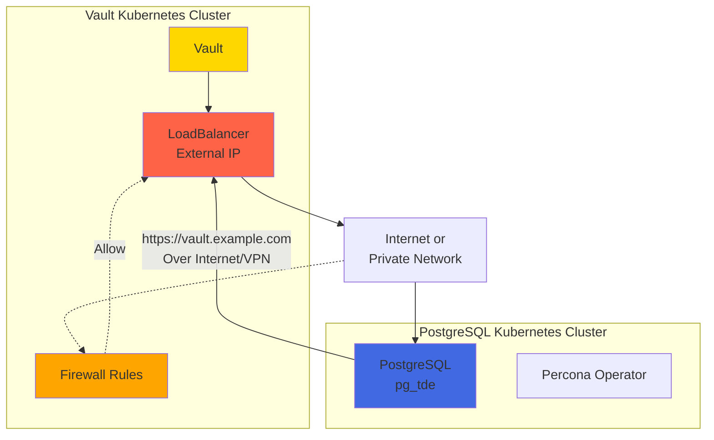
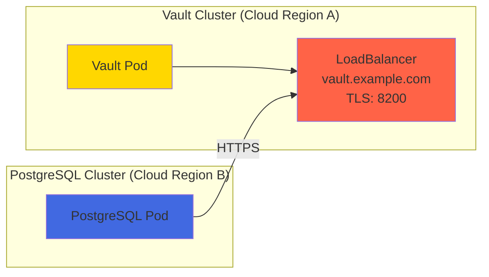
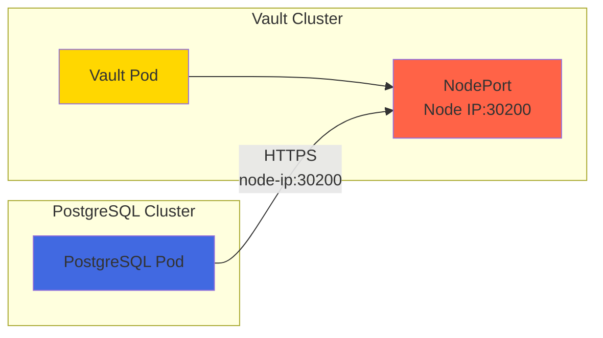
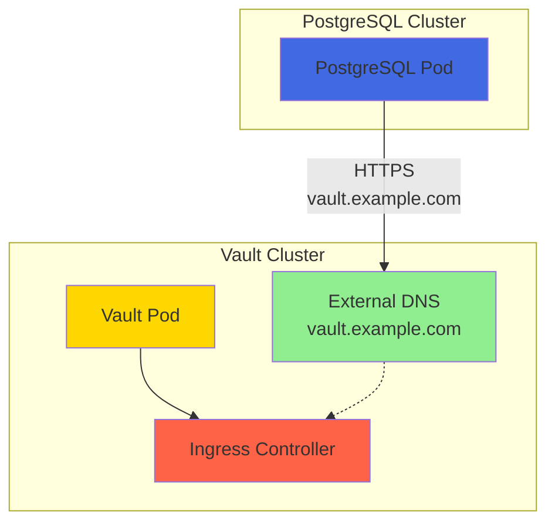
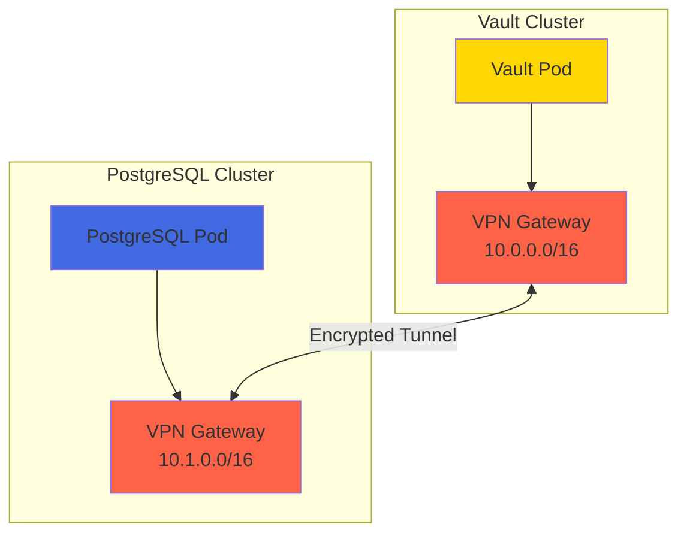
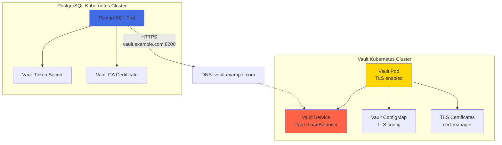
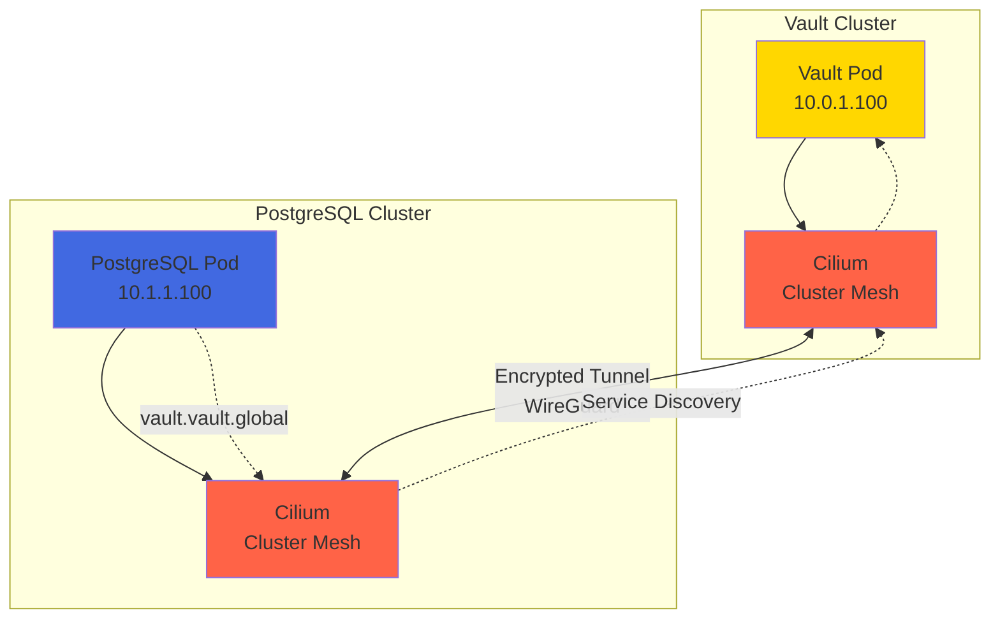
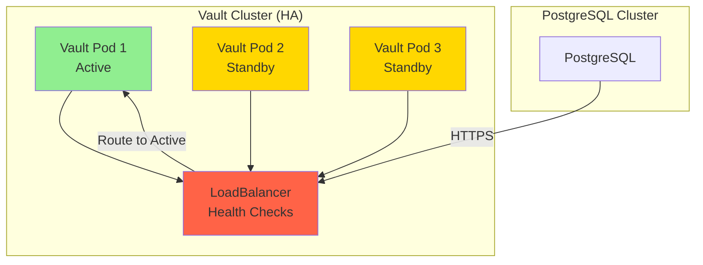
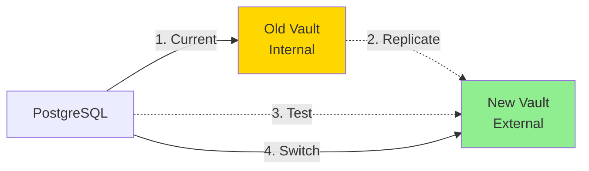

# Separate Clusters Setup: Vault and Percona PostgreSQL

This document explains how to configure Percona PostgreSQL with TDE when Vault is running on a **separate Kubernetes cluster** from PostgreSQL.

## Table of Contents
1. [Architecture Comparison](#architecture-comparison)
2. [Challenges with Separate Clusters](#challenges-with-separate-clusters)
3. [Setup Options](#setup-options)
4. [Recommended Approach: External Vault with LoadBalancer](#recommended-approach-external-vault-with-loadbalancer)
5. [Alternative Approach: VPN/Service Mesh](#alternative-approach-vpnservice-mesh)
6. [Configuration Changes](#configuration-changes)
7. [Security Considerations](#security-considerations)

## Architecture Comparison

### Current Setup: Single Cluster



**Benefits:**
- Simple networking (Kubernetes DNS)
- Low latency (same cluster)
- No firewall rules needed
- Easy service discovery

**Drawbacks:**
- Single point of failure
- Shared cluster resources
- Cannot isolate security domains

### Separate Clusters Setup



**Benefits:**
- Isolated security domains
- Independent scaling
- Separate failure domains
- Vault can serve multiple PostgreSQL clusters

**Challenges:**
- Network connectivity required
- Higher latency
- Firewall configuration
- Certificate management (TLS required)
- More complex troubleshooting

## Challenges with Separate Clusters

### 1. Network Connectivity

**Problem:** Kubernetes internal DNS (`vault.vault.svc.cluster.local`) doesn't work across clusters.

**Solution:** Use external DNS or IP address.

### 2. Service Discovery

**Problem:** PostgreSQL needs to know Vault's external address.

**Solutions:**
- LoadBalancer service (cloud providers)
- NodePort service (on-premises)
- Ingress controller with external DNS
- VPN/Service mesh

### 3. Authentication

**Problem:** Kubernetes auth backend requires pod to authenticate with Vault using service account JWT.

**Challenge:** JWT from Cluster A may not be trusted by Vault in Cluster B.

**Solutions:**
- Use token-based authentication (simpler but less secure)
- Configure Vault Kubernetes auth to trust remote cluster's JWT
- Use AppRole authentication
- Use TLS certificate authentication

### 4. Security

**Problem:** Traffic between clusters goes over network (potentially internet).

**Requirements:**
- TLS encryption (mandatory)
- Certificate validation
- Network policies/firewall rules
- Mutual TLS (optional but recommended)

### 5. High Availability

**Problem:** Network partition between clusters breaks TDE.

**Mitigation:**
- Multiple Vault endpoints
- Connection retry logic
- Cached credentials (if supported)
- Monitoring and alerting

## Setup Options

### Option 1: LoadBalancer Service (Cloud)

Best for cloud deployments (AWS, GCP, Azure).



**Pros:**
- Automatic external IP assignment
- Cloud-native load balancing
- Health checks included
- SSL termination at load balancer

**Cons:**
- Cloud provider dependency
- Costs for load balancer
- Public IP exposure (use private load balancer if available)

### Option 2: NodePort Service (On-Premises)

Best for on-premises or bare-metal Kubernetes.



**Pros:**
- No cloud dependency
- Simple setup
- Direct node access

**Cons:**
- Port management (30000-32767 range)
- No automatic load balancing
- Node IP changes need updates

### Option 3: Ingress with External DNS

Best for production with proper DNS management.



**Pros:**
- Clean DNS names
- SSL termination at ingress
- Certificate management (cert-manager)
- Professional setup

**Cons:**
- Requires DNS management
- Ingress controller needed
- Certificate management overhead

### Option 4: VPN / Service Mesh

Best for secure private network connectivity.



**Pros:**
- Secure private network
- Network-level encryption
- Multi-cluster service mesh
- Can use internal IPs

**Cons:**
- Complex setup
- VPN/mesh overhead
- Additional infrastructure

## Recommended Approach: External Vault with LoadBalancer

This is the most straightforward approach for cloud deployments.

### Architecture



### Step-by-Step Setup

#### 1. Configure Vault with TLS and LoadBalancer

**In Vault Cluster:**

Create `vault/vault-values-external.yaml`:

```yaml
server:
  standalone:
    enabled: true
    config: |
      ui = true

      listener "tcp" {
        address = "[::]:8200"
        cluster_address = "[::]:8201"
        tls_cert_file = "/vault/tls/tls.crt"
        tls_key_file = "/vault/tls/tls.key"
        tls_min_version = "tls12"
      }

      storage "file" {
        path = "/vault/data"
      }

  service:
    enabled: true
    type: LoadBalancer  # Changed from ClusterIP
    port: 8200

  # Mount TLS certificates
  volumes:
    - name: vault-tls
      secret:
        secretName: vault-tls

  volumeMounts:
    - name: vault-tls
      mountPath: /vault/tls
      readOnly: true
```

Install Vault:

```bash
# In Vault cluster
helm upgrade --install vault hashicorp/vault \
  --namespace vault \
  --create-namespace \
  --values vault/vault-values-external.yaml \
  --wait
```

Create TLS certificates (using cert-manager or manual):

```yaml
apiVersion: cert-manager.io/v1
kind: Certificate
metadata:
  name: vault-tls
  namespace: vault
spec:
  secretName: vault-tls
  issuerRef:
    name: letsencrypt-prod
    kind: ClusterIssuer
  dnsNames:
    - vault.example.com
    - vault.example.com
  usages:
    - digital signature
    - key encipherment
    - server auth
```

Get LoadBalancer external IP:

```bash
kubectl get svc -n vault vault -o jsonpath='{.status.loadBalancer.ingress[0].ip}'
# Or for hostname:
kubectl get svc -n vault vault -o jsonpath='{.status.loadBalancer.ingress[0].hostname}'
```

Configure DNS:

```bash
# Add A record
vault.example.com -> <LoadBalancer-IP>
```

#### 2. Configure PostgreSQL Cluster

**In PostgreSQL Cluster:**

Create Vault token secret:

```yaml
apiVersion: v1
kind: Secret
metadata:
  name: vault-token
  namespace: percona
type: Opaque
stringData:
  token: "hvs.YOUR_VAULT_TOKEN_HERE"
```

Create Vault CA certificate secret (if using custom CA):

```yaml
apiVersion: v1
kind: Secret
metadata:
  name: vault-ca
  namespace: percona
type: Opaque
stringData:
  ca.crt: |
    -----BEGIN CERTIFICATE-----
    YOUR_CA_CERTIFICATE_HERE
    -----END CERTIFICATE-----
```

Mount secrets in PostgreSQL cluster YAML:

```yaml
apiVersion: pgv2.percona.com/v2
kind: PerconaPGCluster
metadata:
  name: pg-cluster
  namespace: percona
spec:
  crVersion: 2.8.0
  image: docker.io/percona/percona-distribution-postgresql:17.6-1
  postgresVersion: 17

  patroni:
    dynamicConfiguration:
      postgresql:
        parameters:
          shared_preload_libraries: "pg_tde"

  instances:
  - name: instance1
    replicas: 1

    # Mount Vault secrets
    volumes:
      - name: vault-token
        secret:
          secretName: vault-token
      - name: vault-ca
        secret:
          secretName: vault-ca

    volumeMounts:
      - name: vault-token
        mountPath: /vault/token
        readOnly: true
      - name: vault-ca
        mountPath: /vault/ca
        readOnly: true

    dataVolumeClaimSpec:
      accessModes:
        - ReadWriteOnce
      resources:
        requests:
          storage: 1Gi
```

#### 3. Initialize TDE with External Vault

Modified initialization task in Taskfile:

```yaml
percona:tde:init:external:
  desc: Initialize TDE with external Vault
  vars:
    VAULT_ADDR: '{{.VAULT_ADDR | default "https://vault.example.com:8200"}}'
  cmds:
    - |
      echo "=== Initializing TDE with External Vault ==="
      echo "Vault Address: {{.VAULT_ADDR}}"

      POD_NAME=$(kubectl get pods -n percona -l postgres-operator.crunchydata.com/cluster=pg-cluster,postgres-operator.crunchydata.com/data=postgres,postgres-operator.crunchydata.com/role=primary -o jsonpath='{.items[0].metadata.name}')

      # Initialize pg_tde extension
      kubectl exec -n percona "$POD_NAME" -c database -- psql -U postgres -c "CREATE EXTENSION IF NOT EXISTS pg_tde;"

      # Configure external Vault provider with TLS
      kubectl exec -n percona "$POD_NAME" -c database -- psql -U postgres -c "
      SELECT pg_tde_add_global_key_provider_vault_v2(
        'vault-provider',
        '{{.VAULT_ADDR}}',                    -- External Vault URL
        'secret/data/tde/global-key',
        '/vault/token/token',                  -- Mounted token path
        '/vault/ca/ca.crt'                    -- Mounted CA cert path
      );"

      # Create master key
      kubectl exec -n percona "$POD_NAME" -c database -- psql -U postgres -c "
      SELECT pg_tde_create_key_using_global_key_provider('global-master-key', 'vault-provider');"

      # Set default key
      kubectl exec -n percona "$POD_NAME" -c database -- psql -U postgres -c "
      SELECT pg_tde_set_default_key_using_global_key_provider('global-master-key', 'vault-provider');"

      echo "✓ TDE initialized with external Vault"
```

Run initialization:

```bash
task percona:tde:init:external VAULT_ADDR=https://vault.example.com:8200
```

### Verification

From PostgreSQL cluster:

```bash
# Test Vault connectivity
kubectl exec -n percona <pod> -c database -- \
  curl --cacert /vault/ca/ca.crt \
  https://vault.example.com:8200/v1/sys/health

# Verify TDE configuration
kubectl exec -n percona <pod> -c database -- \
  psql -U postgres -c "SELECT * FROM pg_tde_list_all_global_key_providers();"

# Should show:
# url: https://vault.example.com:8200
# caPath: /vault/ca/ca.crt
```

## Alternative Approach: VPN/Service Mesh

For secure private network connectivity between clusters.

### Using Cilium Cluster Mesh



**Setup Steps:**

1. Install Cilium on both clusters with cluster mesh enabled
2. Connect clusters using `cilium clustermesh connect`
3. Expose Vault service globally
4. Configure PostgreSQL to use global service name

**Benefits:**
- Service discovery works across clusters
- Encrypted networking (WireGuard)
- No public endpoints needed
- Native Kubernetes experience

**Drawbacks:**
- Requires Cilium CNI
- Complex initial setup
- Both clusters must support cluster mesh

## Configuration Changes

### Summary of Required Changes

| Component | Single Cluster | Separate Clusters |
|-----------|---------------|-------------------|
| **Vault URL** | `http://vault.vault.svc.cluster.local:8200` | `https://vault.example.com:8200` |
| **TLS** | Optional | **Required** |
| **Service Type** | ClusterIP | LoadBalancer / NodePort |
| **DNS** | Kubernetes internal | External DNS required |
| **CA Certificate** | Not needed | **Required** for TLS |
| **Token Storage** | In-pod `/tmp/vault/token.txt` | Mounted secret `/vault/token/token` |
| **Authentication** | Token or K8s auth | Token (K8s auth complex) |
| **Network** | Internal | Firewall rules required |

### Taskfile Changes

Create separate tasks for external Vault:

```yaml
tasks:
  # External Vault tasks
  vault:configure:external:
    desc: Configure external Vault for PostgreSQL TDE
    vars:
      VAULT_ADDR: '{{.VAULT_ADDR}}'
      VAULT_TOKEN: '{{.VAULT_TOKEN}}'
    cmds:
      - |
        # Configure Vault from local machine
        export VAULT_ADDR={{.VAULT_ADDR}}
        export VAULT_TOKEN={{.VAULT_TOKEN}}

        # Enable KV v2
        vault secrets enable -path=secret kv-v2

        # Create TDE key
        vault kv put secret/tde/global-key value="encrypted-data-key"

        # Create policy for PostgreSQL
        vault policy write percona-pg-policy - <<EOF
        path "secret/data/tde/*" {
          capabilities = ["read"]
        }
        EOF

  percona:tde:init:external:
    desc: Initialize TDE with external Vault
    # Implementation shown above
```

## Security Considerations

### 1. TLS is Mandatory

**Never** use HTTP for cross-cluster Vault access.

```sql
-- ❌ WRONG - Insecure
SELECT pg_tde_add_global_key_provider_vault_v2(
  'vault-provider',
  'http://vault.example.com:8200',  -- NO!
  ...
);

-- ✓ CORRECT - Secure
SELECT pg_tde_add_global_key_provider_vault_v2(
  'vault-provider',
  'https://vault.example.com:8200',  -- YES!
  ...
  '/vault/ca/ca.crt'  -- CA certificate required
);
```

### 2. Certificate Validation

Use proper certificates:
- **Production:** Let's Encrypt or corporate CA
- **Development:** Self-signed with proper CA distribution

### 3. Network Security

```yaml
# Firewall rules (example)
- Allow TCP 8200 from PostgreSQL cluster IPs to Vault LoadBalancer
- Deny all other traffic to Vault
```

### 4. Token Management

**Don't:**
- Store tokens in git
- Use root token in PostgreSQL
- Share tokens between environments

**Do:**
- Use periodic tokens with TTL
- Rotate tokens regularly
- Use Kubernetes auth if possible
- Store tokens in Kubernetes secrets only

### 5. Monitoring

Monitor:
- Vault connectivity from PostgreSQL
- TLS certificate expiration
- Token expiration
- Network latency between clusters
- Failed authentication attempts

### 6. High Availability



Deploy Vault in HA mode:
- Multiple Vault pods
- Raft or Consul storage backend
- LoadBalancer with health checks
- Automatic failover

## Troubleshooting

### Connection Issues

```bash
# Test from PostgreSQL pod
kubectl exec -n percona <pod> -c database -- \
  curl -v --cacert /vault/ca/ca.crt \
  https://vault.example.com:8200/v1/sys/health

# Check DNS resolution
kubectl exec -n percona <pod> -c database -- \
  nslookup vault.example.com

# Check network connectivity
kubectl exec -n percona <pod> -c database -- \
  nc -zv vault.example.com 8200
```

### Certificate Issues

```bash
# Verify certificate
openssl s_client -connect vault.example.com:8200 -showcerts

# Check certificate validity
kubectl exec -n percona <pod> -c database -- \
  openssl x509 -in /vault/ca/ca.crt -text -noout
```

### TDE Provider Issues

```sql
-- Check provider configuration
SELECT * FROM pg_tde_list_all_global_key_providers();

-- Remove and re-add provider
SELECT pg_tde_delete_global_key_provider('vault-provider');

SELECT pg_tde_add_global_key_provider_vault_v2(
  'vault-provider',
  'https://vault.example.com:8200',
  'secret/data/tde/global-key',
  '/vault/token/token',
  '/vault/ca/ca.crt'
);
```

## Migration from Single to Separate Clusters

### Migration Steps

1. **Setup external Vault** in separate cluster
2. **Export data** from single-cluster Vault
3. **Import data** to external Vault
4. **Update PostgreSQL configuration** to point to external Vault
5. **Test connectivity** before switching
6. **Update pg_tde provider** configuration
7. **Verify encryption** still works
8. **Decommission** old Vault

### Zero-Downtime Migration



## Conclusion

Separating Vault and PostgreSQL clusters adds complexity but provides:
- Better security isolation
- Independent scaling
- Reduced blast radius
- Centralized secret management

**Recommended for:**
- Production environments
- Multi-tenant deployments
- Compliance requirements
- Large-scale deployments

**Use single cluster for:**
- Development environments
- Small deployments
- Proof of concepts
- Simple requirements
