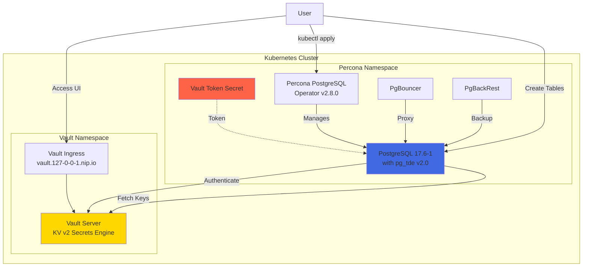
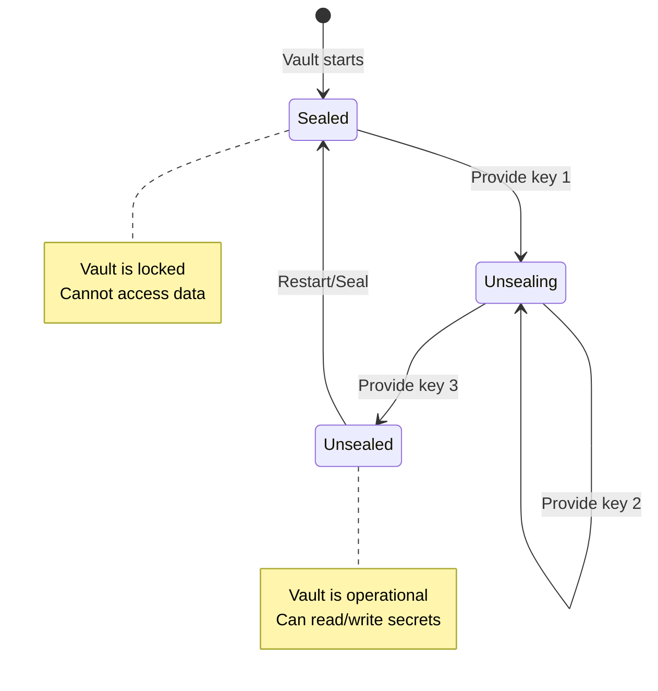
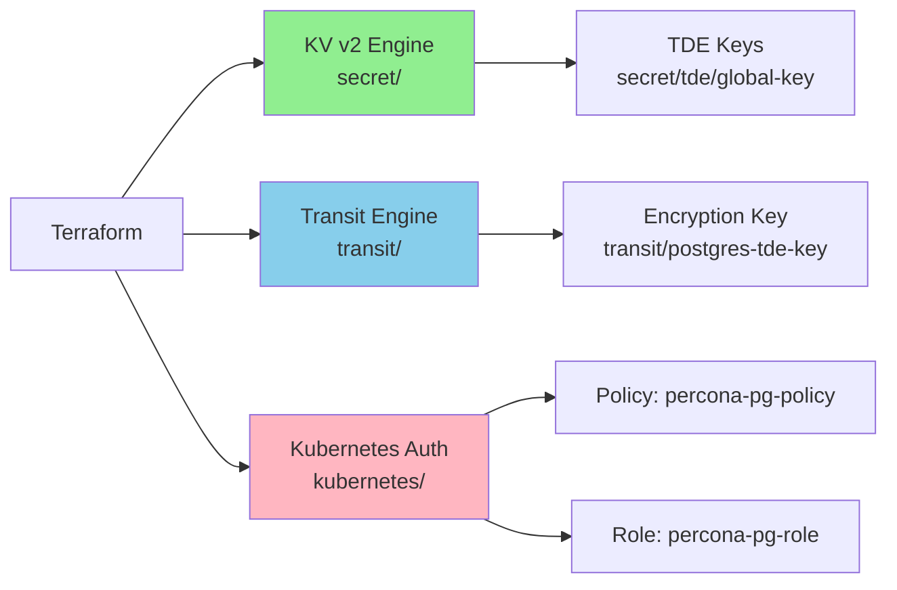
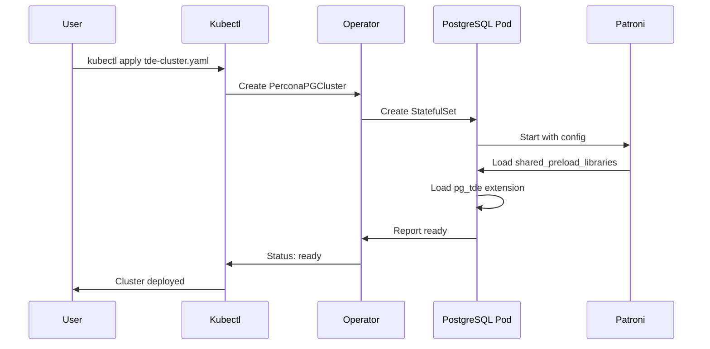
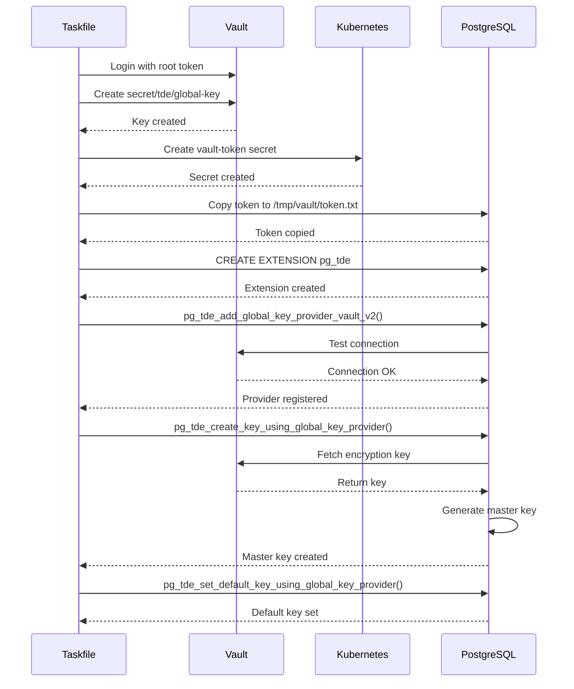
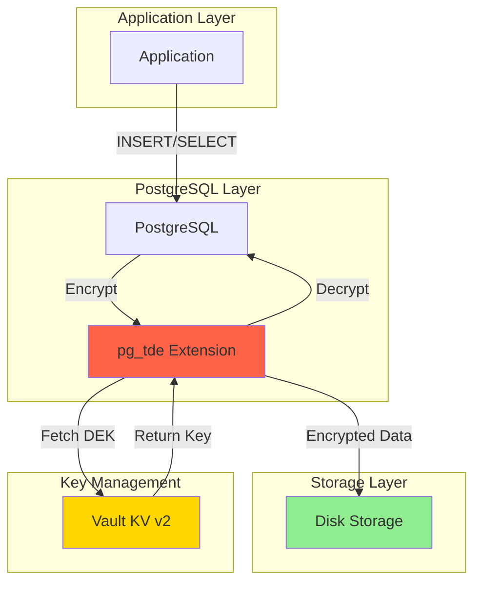
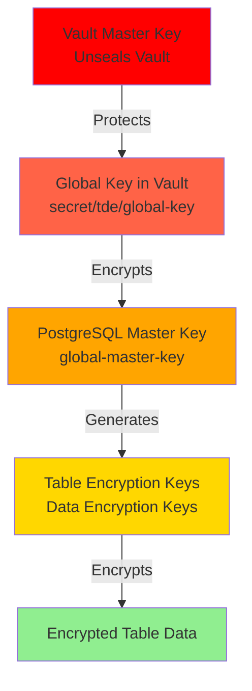
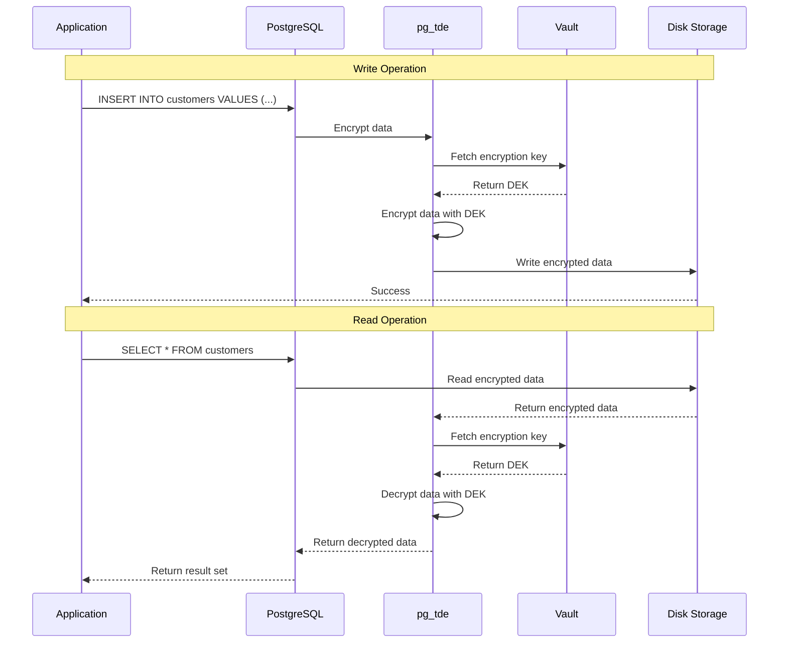

# Complete Setup Guide: Vault & Percona PostgreSQL TDE

This guide explains how to set up HashiCorp Vault and configure Percona PostgreSQL with Transparent Data Encryption (TDE) integration.

## Table of Contents
1. [Architecture Overview](#architecture-overview)
2. [Prerequisites](#prerequisites)
3. [Vault Setup](#vault-setup)
4. [Percona PostgreSQL Setup](#percona-postgresql-setup)
5. [TDE Configuration](#tde-configuration)
6. [How It Works](#how-it-works)
7. [Verification](#verification)

## Architecture Overview



## Prerequisites

- Kubernetes cluster (1.24+)
- kubectl configured
- Helm 3.x installed
- Taskfile (task) installed
- devbox (for package management)
- Traefik ingress controller installed

## Vault Setup

### Step 1: Install Vault

Vault is installed using Helm in standalone mode with file storage.

```bash
task vault:install
```

**What happens:**
1. Creates `vault` namespace
2. Deploys Vault v0.31.0 with configuration from `vault/vault-values.yaml`
3. Configures:
   - Standalone mode (single instance)
   - File-based storage
   - UI enabled
   - TLS disabled (for development)

### Step 2: Initialize Vault

```bash
task vault:init
```

**What happens:**
1. Waits for Vault pod to be running
2. Initializes Vault with:
   - 5 unseal keys
   - Threshold of 3 keys required
3. Saves output to `vault/vault-init-keys.txt`:
   - 5 unseal keys
   - Root token

**Important:** Store `vault/vault-init-keys.txt` securely! These keys are required to unseal Vault after restarts.

### Step 3: Unseal Vault

```bash
task vault:unseal
```

**What happens:**
1. Reads first 3 unseal keys from `vault/vault-init-keys.txt`
2. Executes unseal operation 3 times
3. Vault becomes operational

**Vault Seal Status:**


### Step 4: Create Ingress

```bash
task vault:ingress:apply
```

**What happens:**
1. Creates Traefik ingress resource
2. Maps `vault.127-0-0-1.nip.io` to Vault UI service
3. Vault UI becomes accessible at http://vault.127-0-0-1.nip.io

### Step 5: Configure Vault with Terraform

```bash
task terraform:init
task terraform:apply
```

**What happens:**
1. Initializes Terraform providers
2. Configures Vault resources:
   - **KV v2 Secrets Engine** at `secret/` (for TDE keys)
   - **Transit Secrets Engine** at `transit/` (for encryption operations)
   - **Kubernetes Auth Backend** (for pod authentication)
   - **Policies** for PostgreSQL access
   - **Roles** for service account binding

**Terraform Resources Created:**



## Percona PostgreSQL Setup

### Step 1: Install Percona Operator

```bash
task percona:install
```

**What happens:**
1. Adds Percona Helm repository
2. Installs Percona PostgreSQL Operator v2.8.0 in `percona` namespace
3. Operator starts watching for PerconaPGCluster resources

### Step 2: Deploy PostgreSQL Cluster with TDE Configuration

```bash
kubectl apply -f percona/tde-cluster.yaml
```

**Cluster Configuration:**
```yaml
spec:
  crVersion: 2.8.0
  image: docker.io/percona/percona-distribution-postgresql:17.6-1
  postgresVersion: 17

  # Enable pg_tde via patroni configuration
  patroni:
    dynamicConfiguration:
      postgresql:
        parameters:
          shared_preload_libraries: "pg_tde"  # Critical!
```

**What happens:**
1. Operator creates PostgreSQL StatefulSet
2. Loads pg_tde extension during PostgreSQL startup
3. Deploys supporting components:
   - PgBouncer (connection pooling)
   - PgBackRest (backup/restore)

**Cluster Deployment Flow:**



## TDE Configuration

### Step 1: Initialize TDE

```bash
task percona:tde:init
```

**Detailed steps performed:**

#### 1. Create Vault Token Secret
```bash
# Extracts root token from vault/vault-init-keys.txt
# Creates Kubernetes secret in percona namespace
kubectl create secret generic vault-token \
  --from-literal=token="hvs.xxx..." \
  -n percona
```

#### 2. Configure Vault with TDE Key
```bash
# Login to Vault
vault login <root-token>

# Create TDE encryption key in KV v2
vault kv put secret/tde/global-key value="encrypted-data-key"
```

#### 3. Copy Token to PostgreSQL Pod
```bash
# Create directory in pod
kubectl exec -n percona <pod> -- mkdir -p /tmp/vault

# Copy token file
kubectl exec -n percona <pod> -- sh -c "echo '<token>' > /tmp/vault/token.txt"
```

#### 4. Create pg_tde Extension
```sql
CREATE EXTENSION IF NOT EXISTS pg_tde;
```

#### 5. Configure Vault as Key Provider
```sql
SELECT pg_tde_add_global_key_provider_vault_v2(
  'vault-provider',                                    -- Provider name
  'http://vault.vault.svc.cluster.local:8200',        -- Vault URL
  'secret/data/tde/global-key',                       -- Key path (KV v2 format)
  '/tmp/vault/token.txt',                             -- Token file
  NULL                                                 -- CA path (none for HTTP)
);
```

#### 6. Create Master Encryption Key
```sql
SELECT pg_tde_create_key_using_global_key_provider(
  'global-master-key',    -- Key name
  'vault-provider'        -- Provider to use
);
```

#### 7. Set Default Encryption Key
```sql
SELECT pg_tde_set_default_key_using_global_key_provider(
  'global-master-key',
  'vault-provider'
);
```

**TDE Initialization Flow:**



## How It Works

### Data Encryption Flow



### Key Hierarchy



### Creating Encrypted Tables

```sql
-- Create table with TDE
CREATE TABLE customers (
    id SERIAL PRIMARY KEY,
    name TEXT,
    email TEXT,
    ssn TEXT,
    created_at TIMESTAMP DEFAULT NOW()
) USING tde_heap;  -- Important: specify tde_heap access method

-- Verify encryption
SELECT pg_tde_is_encrypted('customers');
-- Returns: t (true)

-- Check access method
SELECT c.relname, am.amname
FROM pg_class c
JOIN pg_am am ON c.relam = am.oid
WHERE c.relname = 'customers';
-- Returns: customers | tde_heap
```

### Data Access Flow



## Verification

### Verify TDE Status

```bash
# Full verification
task percona:tde:verify

# Verify specific table
task percona:tde:verify TABLE_NAME=customers
```

**Verification checks:**
1. ✓ pg_tde loaded in shared_preload_libraries
2. ✓ pg_tde extension installed
3. ✓ Key provider configured (vault-provider)
4. ✓ Default key set (global-master-key)
5. ✓ Encrypted tables listed
6. ✓ Table encryption verified

### Manual Verification

```sql
-- Check shared libraries
SHOW shared_preload_libraries;
-- Should include: pg_tde

-- Check extension
SELECT * FROM pg_extension WHERE extname = 'pg_tde';

-- List key providers
SELECT * FROM pg_tde_list_all_global_key_providers();
/*
 id |      name      |   type   |                                options
----+----------------+----------+------------------------------------------------------------------------
 -1 | vault-provider | vault-v2 | {"url": "http://vault.vault.svc.cluster.local:8200", ...}
*/

-- Check default key
SELECT * FROM pg_tde_default_key_info();
/*
     key_name      | provider_name  | provider_id | key_creation_time
-------------------+----------------+-------------+-------------------
 global-master-key | vault-provider |          -1 | 2025-11-27 ...
*/

-- List encrypted tables
SELECT c.relname, am.amname
FROM pg_class c
JOIN pg_am am ON c.relam = am.oid
WHERE am.amname = 'tde_heap';

-- Check specific table
SELECT pg_tde_is_encrypted('table_name');
```

## Complete Automated Setup

For a fresh deployment:

```bash
# Setup everything in one command
task all:setup
```

This runs:
1. `task vault:setup` - Install, init, unseal, configure Vault
2. `task percona:setup` - Install operator, deploy cluster, init TDE

## Troubleshooting

### Vault Issues

**Vault is sealed after restart:**
```bash
task vault:unseal
```

**Cannot access Vault UI:**
```bash
# Check ingress
kubectl get ingress -n vault

# Check Vault status
kubectl exec -n vault vault-0 -- vault status
```

### PostgreSQL Issues

**pg_tde not loaded:**
```yaml
# Ensure patroni config in cluster YAML includes:
patroni:
  dynamicConfiguration:
    postgresql:
      parameters:
        shared_preload_libraries: "pg_tde"
```

**Extension creation fails:**
```bash
# Check PostgreSQL logs
kubectl logs -n percona <pod-name> -c database
```

**Cannot connect to Vault:**
```bash
# Test connectivity from pod
kubectl exec -n percona <pod> -c database -- \
  curl http://vault.vault.svc.cluster.local:8200/v1/sys/health
```

### TDE Issues

**Table not encrypted:**
```sql
-- Ensure USING tde_heap is specified
CREATE TABLE test (...) USING tde_heap;

-- Check table access method
SELECT c.relname, am.amname
FROM pg_class c
JOIN pg_am am ON c.relam = am.oid
WHERE c.relname = 'test';
```

**Key provider error:**
```sql
-- Check provider configuration
SELECT * FROM pg_tde_list_all_global_key_providers();

-- Re-add provider if needed
SELECT pg_tde_add_global_key_provider_vault_v2(
  'vault-provider',
  'http://vault.vault.svc.cluster.local:8200',
  'secret/data/tde/global-key',
  '/tmp/vault/token.txt',
  NULL
);
```

## Security Best Practices

1. **Vault Unseal Keys**: Store in a secure vault (not in git)
2. **Root Token**: Rotate regularly and use limited tokens
3. **Token Authentication**: Migrate to Kubernetes auth for production
4. **Network Policies**: Restrict traffic between namespaces
5. **TLS**: Enable TLS for Vault in production
6. **Backups**: Regularly backup Vault data and PostgreSQL
7. **Audit Logging**: Enable Vault audit logs
8. **RBAC**: Use least privilege for Kubernetes service accounts

## Next Steps

1. **Create encrypted tables** for your application data
2. **Test backup and restore** procedures
3. **Implement monitoring** for Vault and PostgreSQL
4. **Configure alerts** for encryption failures
5. **Plan key rotation** strategy
6. **Document disaster recovery** procedures
7. **Review and harden** security configurations

## References

- [Percona PostgreSQL Operator](https://docs.percona.com/percona-operator-for-postgresql/)
- [pg_tde Documentation](https://docs.percona.com/postgresql/latest/tde.html)
- [HashiCorp Vault](https://developer.hashicorp.com/vault)
- [PostgreSQL 17](https://www.postgresql.org/docs/17/)
